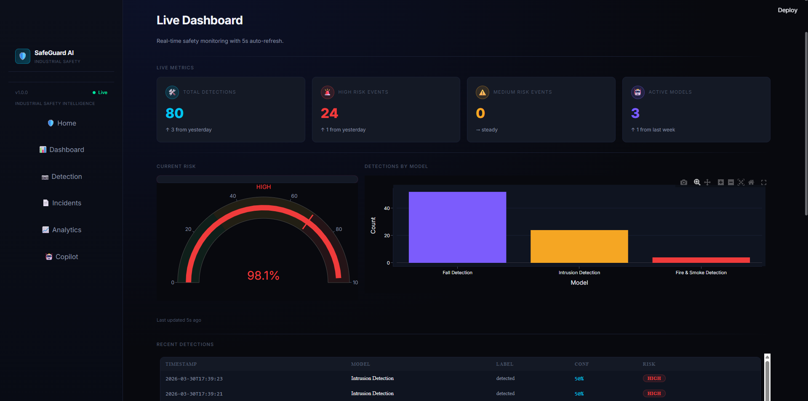
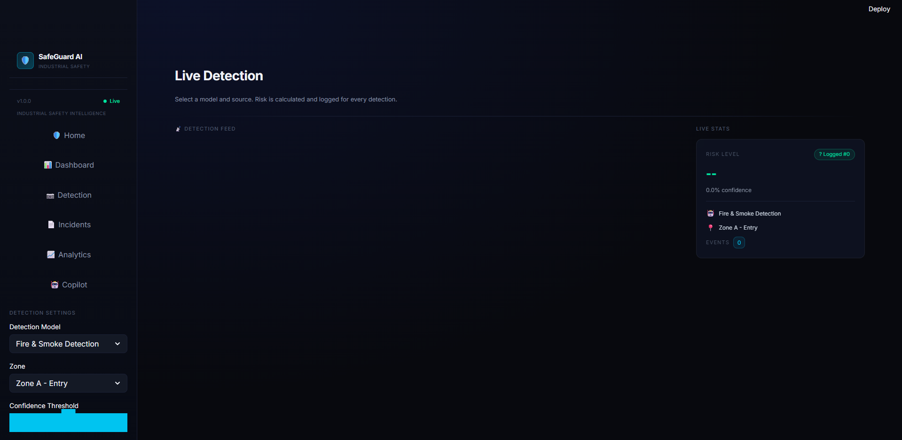
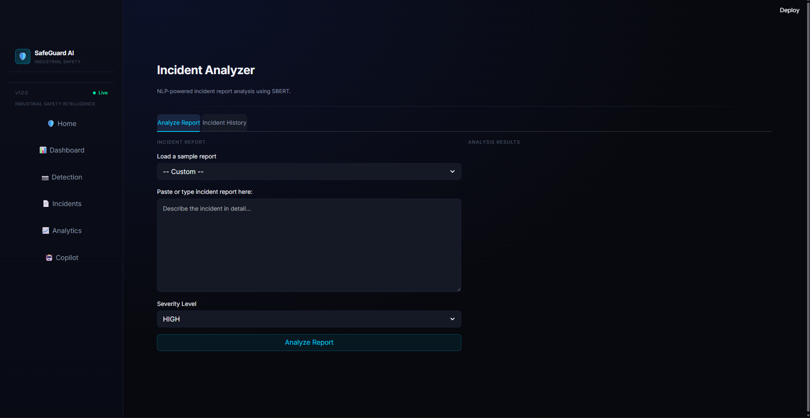
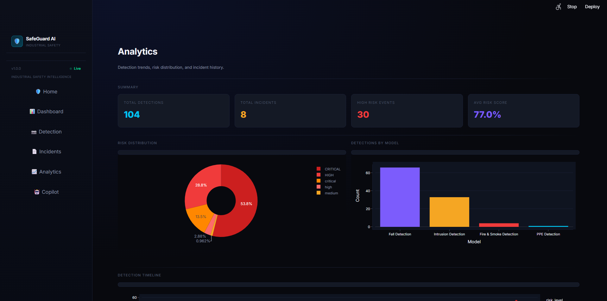
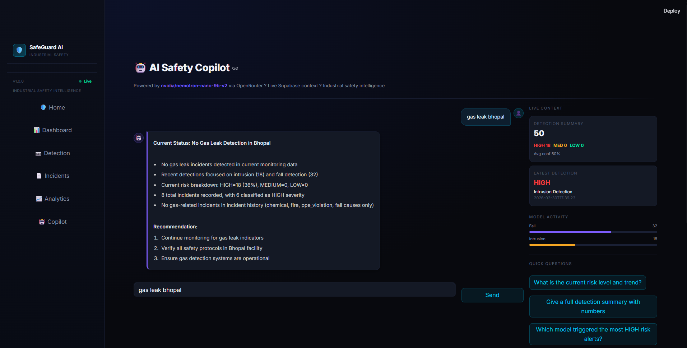

# 🛡️ SafeGuard AI

**Industrial Safety Monitoring System powered by Computer Vision, Machine Learning, and NLP**

[](https://python.org)
[](https://streamlit.io)
[](https://github.com/sunsmarterjie/yolov12)
[](https://supabase.com)
[](LICENSE)

---

## 📌 Overview

SafeGuard AI is a real-time industrial safety monitoring platform that integrates
multiple AI models into a unified dashboard. Built as part of the EPICS
(Engineering Projects in Community Service) initiative at VIT.

The system continuously monitors industrial environments for:
- 🔥 **Fire & Smoke** — YOLOv12 custom-trained detection
- 🦺 **PPE Violations** — Hard hat, vest, goggles compliance
- 🚫 **Intrusion** — Unauthorized access with custom polygon zones
- 🏥 **Fall Detection** — Worker fall alerts
- 📊 **Risk Scoring** — XGBoost real-time risk prediction
- 📄 **Incident Analysis** — SBERT NLP cause extraction & rule matching
- 🤖 **AI Copilot** — LLM-powered safety assistant with live data context

---

## 🖥️ Screenshots

| Dashboard | Detection | Incidents |
|-----------|-----------|-----------|
|  |  |  |

| Analytics | AI Copilot |
|-----------|-----------|
|  |  |

---

## 🏗️ Architecture

```
SafeGuard AI
├── Computer Vision Layer    → YOLO models (fire, PPE, intrusion, fall)
├── Risk Engine Layer        → XGBoost multi-class risk classifier
├── NLP Layer                → SBERT incident report analyzer
├── Data Layer               → Supabase (PostgreSQL + real-time)
├── LLM Layer                → Nemotron via OpenRouter (AI Copilot)
└── Frontend Layer           → Streamlit multipage dashboard
```

---

## 📁 Project Structure

```
SafeGuard-AI/
├── app.py                    # Main entry point
├── pages/                    # Streamlit multipage
│   ├── 01_Dashboard.py       # Live risk gauge + alert feed
│   ├── 02_Detection.py       # YOLO detection with polygon zones
│   ├── 03_Incidents.py       # NLP incident analyzer
│   ├── 04_Analytics.py       # Charts, trends, CSV export
│   └── 05_Copilot.py         # AI Safety Copilot (LLM)
├── backend/                  # Business logic
│   ├── supabase_client.py    # Database operations
│   ├── risk_engine.py        # Risk prediction wrapper
│   ├── nlp_engine.py         # NLP analysis wrapper
│   └── services/             # Core ML services
├── models/                   # CV detection modules
│   ├── fire_detector.py
│   ├── ppe_detector.py
│   ├── intrusion_detector.py
│   └── fall_detector.py
├── cv_models/                # Model weights (see cv_models/README.md)
├── ml_models/                # ML model files (see ml_models/README.md)
├── notebooks/                # Training notebooks
├── utils/                    # Shared utilities (CSS, themes)
└── assets/                   # Static files + screenshots
```

---

## 🚀 Quick Start

### Prerequisites
- Python 3.10+
- NVIDIA GPU (recommended) with CUDA 12.x
- Supabase account
- OpenRouter API key

### Installation

```bash
# 1. Clone the repository
git clone https://github.com/YOUR_USERNAME/SafeGuard-AI.git
cd SafeGuard-AI

# 2. Create virtual environment
python -m venv venv
venv\Scripts\activate        # Windows
source venv/bin/activate     # Linux/Mac

# 3. Install dependencies
pip install -r requirements.txt

# 4. Configure secrets
cp .streamlit/secrets.toml.example .streamlit/secrets.toml
# Edit secrets.toml with your API keys

# 5. Download model weights
# See cv_models/README.md and ml_models/README.md

# 6. Run
streamlit run app.py
```

### Supabase Setup

Run the following SQL in your Supabase SQL Editor:

```sql
create table if not exists detections (
  id          uuid default gen_random_uuid() primary key,
  timestamp   timestamptz default now(),
  model_type  text,
  label       text,
  confidence  float,
  risk_level  text,
  risk_score  float
);

create table if not exists incidents (
  id           uuid default gen_random_uuid() primary key,
  timestamp    timestamptz default now(),
  report_text  text,
  severity     text,
  nlp_result   jsonb
);
```

---

## 🧠 Models Used

| Model | Task | Architecture | Dataset |
|-------|------|-------------|---------|
| Fire Detector | Fire & Smoke | YOLOv12n | Custom forest-fire dataset |
| PPE Detector | PPE Compliance | YOLOv8n | Roboflow PPE dataset |
| Intrusion Detector | Person Detection | YOLOv8m | COCO pretrained |
| Fall Detector | Fall Detection | YOLOv8n | Custom fall dataset |
| Risk Engine | Risk Scoring | XGBoost | Synthetic industrial data |
| NLP Engine | Report Analysis | SBERT (all-MiniLM-L6-v2) | Safety rules corpus |
| AI Copilot | Safety Q&A | Nemotron-nano-9b-v2 | OpenRouter API |

---

## 🔧 Configuration

| Variable | Description | Required |
|----------|-------------|----------|
| `OPENROUTER_API_KEY` | OpenRouter API key for AI Copilot | Yes |
| `SUPABASE_URL` | Your Supabase project URL | Yes |
| `SUPABASE_KEY` | Supabase anon/public key | Yes |

---

## 📊 Features

- ✅ Real-time multi-model detection (webcam, video, image)
- ✅ Custom polygon zone definition for intrusion detection
- ✅ XGBoost risk scoring (LOW / MEDIUM / HIGH / CRITICAL)
- ✅ SBERT NLP incident analyzer (cause extraction + rule matching)
- ✅ Supabase real-time logging and history
- ✅ AI Copilot with live database context (Nemotron LLM)
- ✅ Professional dark industrial dashboard UI
- ✅ Export detections and incidents as CSV
- ✅ Plotly analytics with model-specific color coding

---

## 👨‍💻 Built With

- [Streamlit](https://streamlit.io) — Frontend dashboard
- [Ultralytics](https://ultralytics.com) — YOLO models
- [XGBoost](https://xgboost.readthedocs.io) — Risk engine
- [Sentence Transformers](https://sbert.net) — NLP embeddings
- [Supabase](https://supabase.com) — Database & auth
- [OpenRouter](https://openrouter.ai) — LLM API
- [Plotly](https://plotly.com) — Data visualization
- [Shapely](https://shapely.readthedocs.io) — Polygon geometry

---

## 📄 License

MIT License — see [LICENSE](LICENSE) for details.

---

## 🎓 Academic Context

Developed as part of the **EPICS (Engineering Projects in Community Service)**
program at VIT (Vellore Institute of Technology).

Project: SafeGuard AI — Multi-layer AI-based Industrial Safety Monitoring System
Team: PART-A SafeGuard AI Team

---
